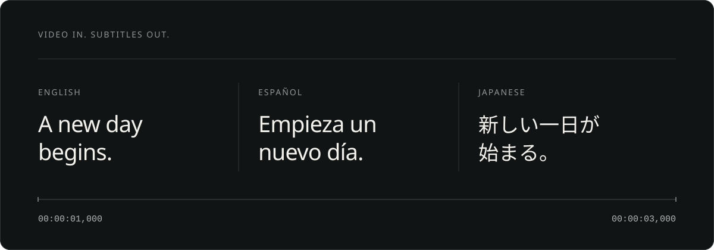

<h1 align="center">CaptionWeave</h1>
<p align="center">Transcribe your video. Get subtitles in your language.</p>



<p align="center">Video / audio → Transcription → Translation → SRT &amp; ASS</p>

No existing subtitles required.

## Start

Python 3.11+ and FFmpeg. [Setup →](docs/usage.md#requirements-and-installation)

From a checkout, in a virtual environment:

```sh
python -m pip install '.[asr]'
captionweave run lecture.mp4 --language auto --target zh
```

Transcribes speech locally. Your assistant translates it to Chinese.

Runs on CPU, NVIDIA CUDA, or [Apple Silicon with Metal](docs/apple-silicon.md).

## Translate

Ask Codex, Claude, Kimi, or another assistant with local file access:

> Follow AGENTS.md. Create Simplified Chinese subtitles for lecture.mp4.

Your current assistant translates. No extra translation API key.

---

[Guide](docs/usage.md) · [Assistant workflow](AGENTS.md) · [Contributing](CONTRIBUTING.md) · [MIT](LICENSE)
